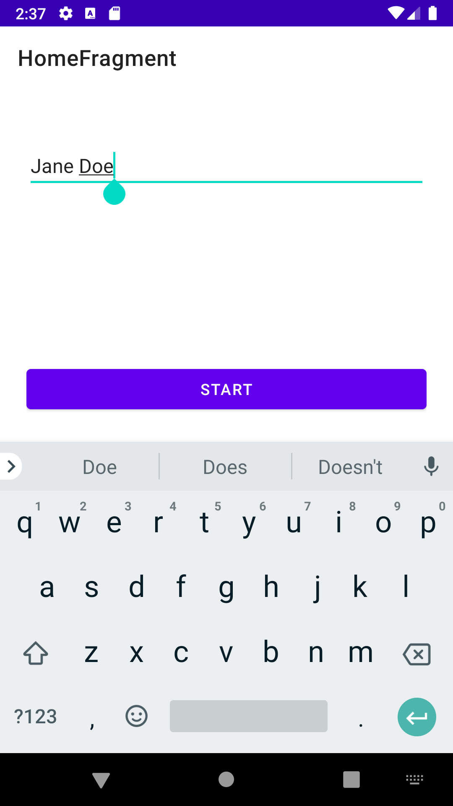
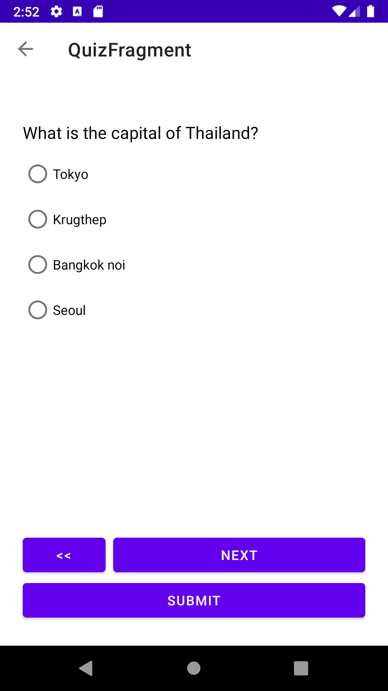
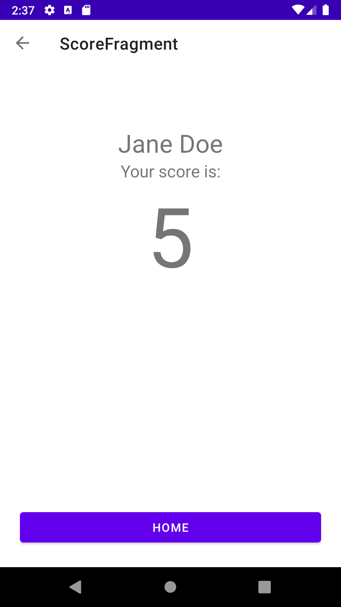

# Assignee

Jitrapon Tiachunpun

## Improvements

1. Allow only portrait orientation
2. Adjust size of layout when the keyboard appears to fit the screen
3. Add test cases for home screen

## Bug Fixes

1. Fix app crashes on launch due to a theme issue on dark mode
2. Fix question text colored as black in dark mode
3. Fix name input text allowing multiple lines
4. Fix filling in empty name allowing to proceed to quiz screen

## Application Specs

This is a quiz application consisting of 3 screens. You are being asked to add the 4th screen:

1. **Welcome Screen** - lets users enter their name then click "START". Name
   is required and the user cannot proceed without entering some text
2. **Quiz Screen** - there are 10 multiple choice questions displayed randomly.
   Users can navigate between questions before submitting the quiz for scoring
3. **Result Screen** - once the user taps "Submit" the app will take user to this
   screen and show user's total score. This screen allows navigating back to the
   Welcome Screen
4. **TODO: Scoreboard Screen** - display a list of people who have taken the quiz, their score, and
   their rank

## Optional

If time permits, or if you feel like, please feel free to improve the app in any way you'd like. Some
ideas are provided below:

1. Improve the UX/UI
1. Refactor/reorganize the app code for modularization/maintainability
